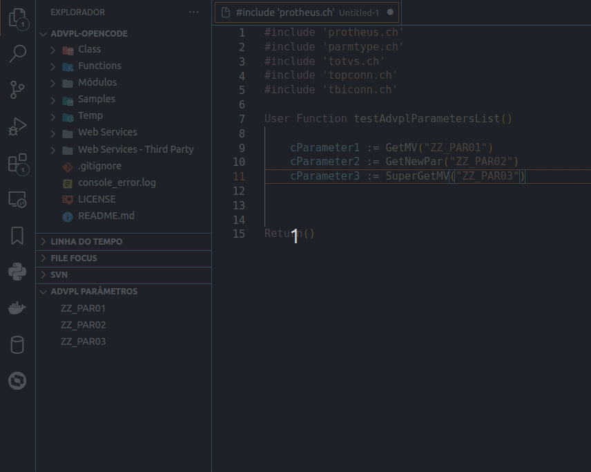

# advpl-parameters-list

A extensão AdvPL Parameter List oferece uma maneira eficiente de listar e visualizar os parâmetros utilizados no código fonte AdvPL em edição no Visual Studio Code. 
Desenvolvida especialmente para programadores AdvPL, essa ferramenta simplifica o processo de compreensão e navegação através dos parâmetros de funções e métodos, melhorando a produtividade durante o desenvolvimento.

A extensão **advpl-parameters-list** fornece uma maneira conveniente de navegar e explorar os parâmetros usados em arquivos AdvPL (Advanced Protheus Language) dentro do Visual Studio Code.

## Recursos Principais
- **Navegação de Parâmetros**: Navegue rapidamente pelos arquivos AdvPL e vá para a definição dos parâmetros.
- **Listagem de Parâmetros**: Visualize uma lista de parâmetros usados no arquivo AdvPL atual.
- **Atualização Dinâmica**: A lista de parâmetros é atualizada automaticamente conforme você edita o arquivo AdvPL.

## Como Usar

Basta abrir um arquivo de código-fonte no Visual Studio Code e visualizar a barra lateral do explorador de arquivos. Você encontrará o menu AdvPL Parâmetros contendo os parâmetros encontradas no arquivo em edição.

## Amostra

## Requisitos

Não há requisitos ou dependências específicas para esta extensão. Ela se integra perfeitamente ao seu ambiente do Visual Studio Code.

## Configurações da Extensão

advplParametersList.regex.GetMV: Define expressao regex para busca das chamadas a funcao GetMV
advplParametersList.regex.GetNewPar: Define expressao regex para busca das chamadas a funcao GetNewPar
advplParametersList.regex.SuperGetMV: Define expressao regex para busca das chamadas a funcao SuperGetMV

## Contribua

Você pode contribuir com o desenvolvimento desta extensão de várias maneiras:

1. Reporte problemas e sugira novos recursos na [página de issues do GitHub](https://github.com/juliansantosinfo/advpl-parameters-list/issues).
2. Faça um fork do repositório, faça suas alterações e envie um pull request.
3. Ajude a melhorar a documentação.
4. Compartilhe esta extensão com outros desenvolvedores.

## Problemas Conhecidos

Atualmente não há problemas conhecidos com esta extensão. Se encontrar algum problema, por favor, reporte na [página de issues do GitHub](https://github.com/juliansantosinfo/advpl-parameters-list/issues).

## Notas de Lançamento

### 0.0.4 (27/04/2024)
* __Bug Fix__: Corrige erro ao ativar extensão sem nenhum arquivo aberto no editor.

### 0.0.3 (11/03/2024)
* __Feature__: Adicionado icones a arvore de parâmetros.
* __Bug Fix__: Ajusta expressões regulares padrão para os parâmetros.

### 0.0.2 (09/03/2024)
* __Docs__: Atualizada documentação adicionando gif animado demonstrando o uso da extensão
* __Docs__: Atualizada documentação adicionando informações para contribuição ao desenvolvimento da extensão

### 0.0.1 (09/03/2024)
* Lançamento inicial da extensão **advpl-parameters-list**. Adiciona suporte para listar e explorar parâmetros diretamente na barra lateral do explorador de arquivos.

